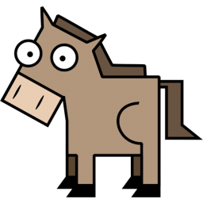

# Workhorse Quarkus

> Extendable Java CDI Job Engine for background jobs and business critical tasks on Quarkus


## Table of Contents


- [Who is this Workhorse?](#who-is-this-workhorse)
- [Install](#install)
- [Getting started](#getting-started)
- [Maintainers](#maintainers)
- [Changelog](#changelog)
- [Contribute](#contribute)
- [License](#license)


## Who is this Workhorse?

The coodoo Workhorse is a Java CDI Job Engine for mostly all kind of tasks and background jobs as it is a combination of task scheduler and an event system. It can help you to send out thousands of e-mails or perform long running imports.

Just fire jobs on demand when ever from where ever in your code and Workhorse will take care of it. You can also define an interval or specific time the job has to be started by using the cron syntax. There are also many options like prioritizing, delaying, chaining, multithreading, uniquifying and retrying the jobs. 


## Install

### Maven dependency

Add the following dependency to your project ([published on Maven Central](https://search.maven.org/artifact/io.coodoo/workhorse))
   
   ```xml
   <dependency>
       <groupId>io.coodoo</groupId>
       <artifactId>workhorse-quarkus</artifactId>
       <version>2.0.0-RC3-SNAPSHOT</version>
   </dependency>
   ```
### Start the engine

You can now start the engine. For it just call the method `start()` of the `WorkhorseService` in a singleton bean (i.e `StartUp`) of your application. You can also define which persistence you want to use. There is also a `stop()` method to halt that beast.

```java
import javax.enterprise.context.ApplicationScoped;
import javax.enterprise.event.Observes;
import io.quarkus.runtime.StartupEvent;

@ApplicationScoped
public class StartUp { 

  @Inject
  WorkhorseService workhorseService;

  public void onStart(@Observes StartupEvent ev) { 
      workhorseService.start(new MemoryConfig());
  }

}
```

### Log lines 

The following log lines are expected when workhorse starts.

```
Workhorse Core initializing… ([Version])
Workhorse Persistence initializing... ([Version])
Workhorse Jobs initializing…

```

## Getting started

To learn more about the engine have a look on the full documentation.

- [Workhorse](https://gitlab.coodoo.io/workhorse/-/blob/master/README.md)

### Scheduled worker

To perform scheduled worker on Quarkus the worker must have the scope `@Startup`. So the bean is instantiated at startup of the quarkus application and can be found by workhorse.

```java
@Startup
@InitialJobConfig(schedule = "0 30 3 0 0 0", description = "Log nightly")
public class HelloWorldWorker extends WorkerWith<String> {

    private final Logger log = LoggerFactory.getLogger(HelloWorldWorker.class);

    @Override
    public void onSchedule() {
        createExecution("Workhorse");
    }

    @Override
    public void doWork(String environment) {
        log.info("Hello World to: " + environment);
    }
}
```

## Changelog

All release changes can be viewed on our [changelog](./CHANGELOG.md).

## Maintainers

[coodoo](https://github.com/orgs/coodoo-io/people)

## Contribute

You can read [how to contribute here](./CONTRIBUTING.md).


### Definition of Done

- There is JavaDoc 


To spice things up


## License

[Apache-2.0 © coodoo GmbH](./LICENSE)

Logo: [Martin Bérubé](http://www.how-to-draw-funny-cartoons.com)
